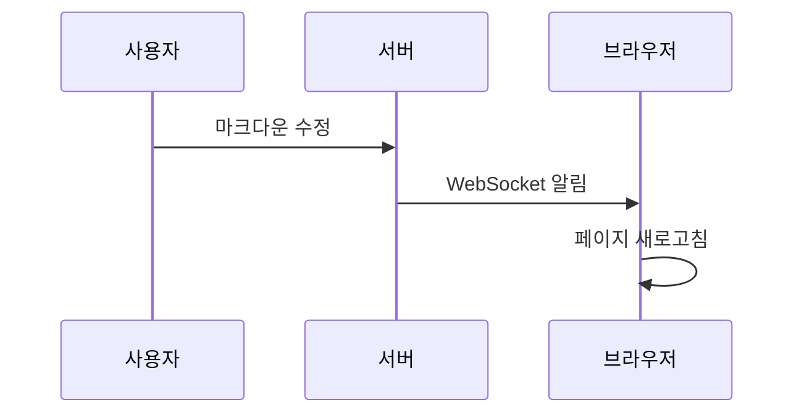

# 🚀 마크다운 렌더러 테스트

이 파일을 수정하면 **실시간**으로 브라우저에 반영됩니다!

## 기능 테스트

### 텍스트 스타일

- **굵은 텍스트**
- *기울임 텍스트*
- ~~취소선~~
- `인라인 코드`

### 코드 블록

```javascript
function hello() {
  console.log('Hello, Markdown!');
}
```

### 인용문

> 이것은 인용문입니다.
> 여러 줄로 작성할 수 있습니다.

### 링크

[GitHub](https://github.com)

### 리스트

1. 첫 번째 항목
2. 두 번째 항목
3. 세 번째 항목

### 테이블

| 기능 | 상태 |
|------|------|
| 렌더링 | ✅ |
| 핫로드 | ✅ |
| 실시간 | ✅ |

### KaTeX

$E=mc^2$
$a^2+b^2=c^2$
$\frac{1}{x^2+1}$
$$
\int_0^\infty e^{-x^2} dx = \frac{\sqrt{\pi}}{2}
$$

### Mermaid 다이어그램



### attrs 플러그인 {.text-4xl .font-bold .text-blue-600}

일반 문단입니다. {.text-gray-700 .leading-relaxed}

- 리스트 아이템 {.text-red-500}
- 다른 아이템

{.rounded-xl .shadow-lg .w-full}

[링크](https://example.com){.text-blue-500 .hover:underline #my-link}

> 인용문 {.bg-gray-100 .p-4 .border-l-4 .border-blue-500}

`인라인 코드`{.bg-yellow-100 .px-1 .rounded}

---

📝 **content** 폴더의 마크다운 파일을 수정해보세요!
